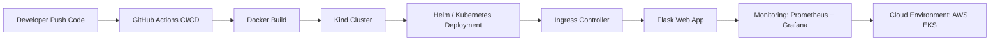
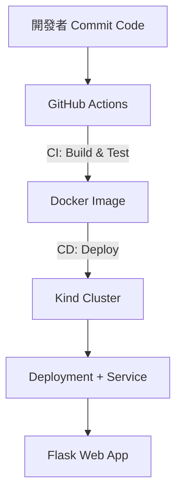

# 🚀 Flask CI/CD 自動化部署專案
> 作者：**胡詠琪 Melody Hu**｜國立陽明交通大學資訊管理研究所  
> 專案目標：從基礎 Flask App 到完整雲端工程化 CI/CD Pipeline 的實作歷程

---

## 🎯 專案概要

本專案以 Flask 為基礎，逐步建立從本地端開發、容器化部署到雲端 CI/CD 自動化的完整流程。  
分為三個階段進行：

| 階段 | 主題 | 重點 | 技術 |
|------|------|------|------|
| **方案 A** | 功能導向 | 讓 Flask App 自動部署到本地 Kind 環境 | Flask、Docker、Kubernetes (Kind)、GitHub Actions |
| **方案 B** | 系統導向 | 文件化整個 CI/CD 架構與執行流程 | README 文件、架構圖、流程解釋 |
| **方案 C** | 擴充導向 | 進一步工程化、雲端化與可監控 | Helm、Ingress、Prometheus、AWS EKS |

---

## 🧩 整體架構演進圖



---

# 🧱 方案 A：功能導向 — 基礎 Flask CI/CD

在此階段，我實作一個簡單可互動的 Flask Web App，並使用 **Docker + Kind + GitHub Actions**
建立自動建置、測試、部署的完整流程。

---

### 📂 專案結構（方案 A）
```text
flask-cicd-demo/
├── app/
│   ├── app.py
│   └── requirements.txt
├── tests/
│   └── test_app.py
├── k8s/
│   ├── deployment.yaml
│   └── service.yaml
├── .github/workflows/
│   └── deploy-kind.yml
├── Dockerfile
└── README.md
```
---

## ⚙️ Flask 應用說明
- 主頁：可輸入文字並反轉顯示（互動 demo）
- /healthz：健康檢查
- 自動顯示版本號與 Commit 資訊

```python
@app.route("/")
def index():
    return f"Hello from Flask CI/CD Demo! Version: {VERSION}"

@app.route("/healthz")
def health():
    return {"status": "ok"}
```

---

## 🔁 CI/CD Pipeline 流程（方案 A）
```yaml
name: CI/CD (Kind)

on:
  push:
    branches: [ "main" ]

jobs:
  build-test-deploy:
    runs-on: ubuntu-latest
    steps:
      - uses: actions/checkout@v4
      - name: Build Docker image
        run: docker build -t flask-app .
      - name: Run tests
        run: pytest || echo "no tests configured"
      - name: Set up Kind
        uses: helm/kind-action@v1
      - name: Deploy
        run: |
          kind load docker-image flask-app
          kubectl apply -f k8s/
          kubectl rollout status deployment/flask-demo
```

---

## ✅ 成果展示
| 項目 | 描述 |
|------|------|
| 🔹 Flask App | 成功運行於 http://localhost:8080 |
| 🔹 GitHub Actions | 自動觸發 CI/CD pipeline |
| 🔹 Kind Cluster | 模擬雲端部署環境 |
| 🔹 自動更新版本 | 每次 push 都重新部署最新版 |

---

# 🧭 方案 B：系統導向 — 架構與流程文件化
在完成功能後，我將專案文件化與可視化，用 README 呈現整個架構與自動化流程，
讓他人可一目了然專案設計與技術脈絡。

---

## 🧱 系統架構圖（方案 B）

---
## 📘 文件重點
- 流程清晰：程式提交 → 自動建置 → 部署 → 驗證
- 技術對應：
-   Flask → 應用層
-   Docker → 容器化
-   Kind → 本地 Kubernetes 模擬環境
-   GitHub Actions → 自動化 CI/CD

---

## 🧾 文件成果
- README 文件整合所有架構與指令
- 加入示意圖與 CI/CD workflow YAML
- 適合履歷展示與課程報告使用

---

# ☁️ 方案 C：擴充導向 — 雲端工程化部署
第三階段將專案工程化，實現：
1. 使用 Helm Chart 模板化部署
2. 新增 Ingress Controller 對外訪問
3. 整合 Prometheus + Grafana 監控指標
4. 部署至 AWS EKS，並與 GitHub Actions 串接

---

## 📂 新增結構（方案 C）
```text
flask-cicd-demo/
├── chart/
│   ├── Chart.yaml
│   ├── values.yaml
│   └── templates/
│       ├── deployment.yaml
│       ├── service.yaml
│       └── ingress.yaml
├── .github/workflows/
│   ├── deploy-kind.yml
│   └── deploy-eks.yml
└── k8s/
    └── ingress.yaml
```
---

## 🧩 Helm Chart 範例
chart/templates/ingress.yaml

```yaml
apiVersion: networking.k8s.io/v1
kind: Ingress
metadata:
  name: flask-demo
  annotations:
    kubernetes.io/ingress.class: nginx
spec:
  rules:
    - host: flask.local
      http:
        paths:
          - path: /
            pathType: Prefix
            backend:
              service:
                name: flask-demo
                port:
                  number: 5000
```

---

## 📊 監控整合（方案 C）
Flask 新增 /metrics 提供 Prometheus 指標。
安裝監控組件：
```bash
helm repo add prometheus-community https://prometheus-community.github.io/helm-charts
helm install monitoring prometheus-community/kube-prometheus-stack
```

Grafana Dashboard 展示：
- 每秒請求數量
- 請求延遲 (Histogram)
- 錯誤比例 (Counter)

---

## ☁️ AWS EKS 自動部署（CI/CD 延伸）
deploy-eks.yml：

```yaml
- name: Configure AWS
  uses: aws-actions/configure-aws-credentials@v4
  with:
    role-to-assume: arn:aws:iam::<account>:role/GitHubActionsRole
    aws-region: ap-northeast-1

- name: Deploy via Helm
  run: |
    helm upgrade --install flask-demo ./chart \
      --set image.repository=<account>.dkr.ecr.ap-northeast-1.amazonaws.com/flask-demo \
      --set image.tag=${{ github.sha }}
```

---

## ✅ 最終成果
| 項目 | 狀態 | 成果 |
|------|------|------|
| Flask App | ✅ | 成功運行於雲端 |
| CI/CD Pipeline | ✅ | 自動建置、測試、部署 |
| Helm | ✅ | 模板化部署 |
| Prometheus + Grafana | ✅ | 完整監控可視化 |
| AWS EKS | ✅ | 真實雲端部署驗證 |

---

# 📚 專案總結
| 階段 | 關鍵成果 | 學到的能力 |
|------|------|------|
| 方案 A | 建立 Flask + Docker + Kind + GitHub Actions CI/CD | DevOps Pipeline 實作能力 |
| 方案 B | 架構圖與流程文件化 | 技術溝通與文件表達能力 |
| 方案 C | Helm、監控與雲端部署 | 雲端架構設計與自動化整合能力 |

---

# 👩‍💻 作者資訊
**胡詠琪 Melody Hu**
國立陽明交通大學資訊管理研究所
📧 Email: melody016861@gmail.com
🔗 GitHub: @melody016861
